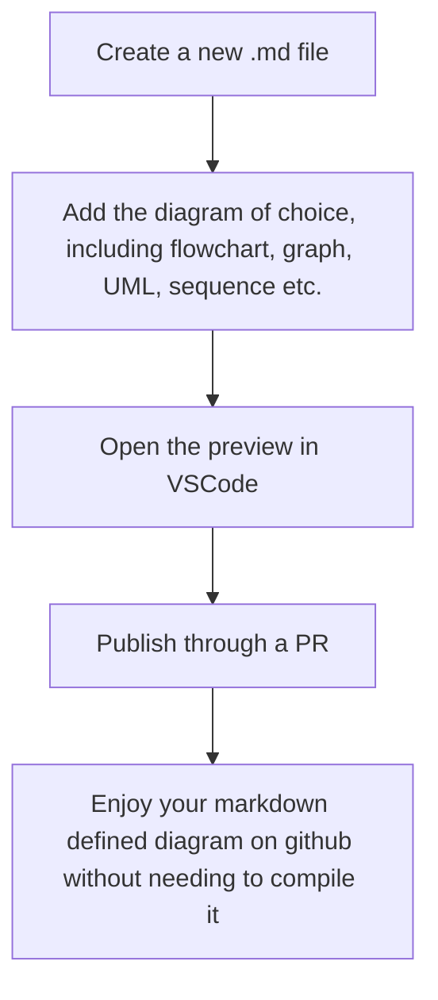

```mermaid
flowchart TD
    A[Create a new .md file] 
    A --> B[Add the diagram of choice, including flowchart, graph, UML, sequence etc.]
    B --> C[Open the preview in VSCode]
    C --> D[Publish through a PR]
    D --> E[Enjoy your markdown defined diagram on github without needing to compile it]
```